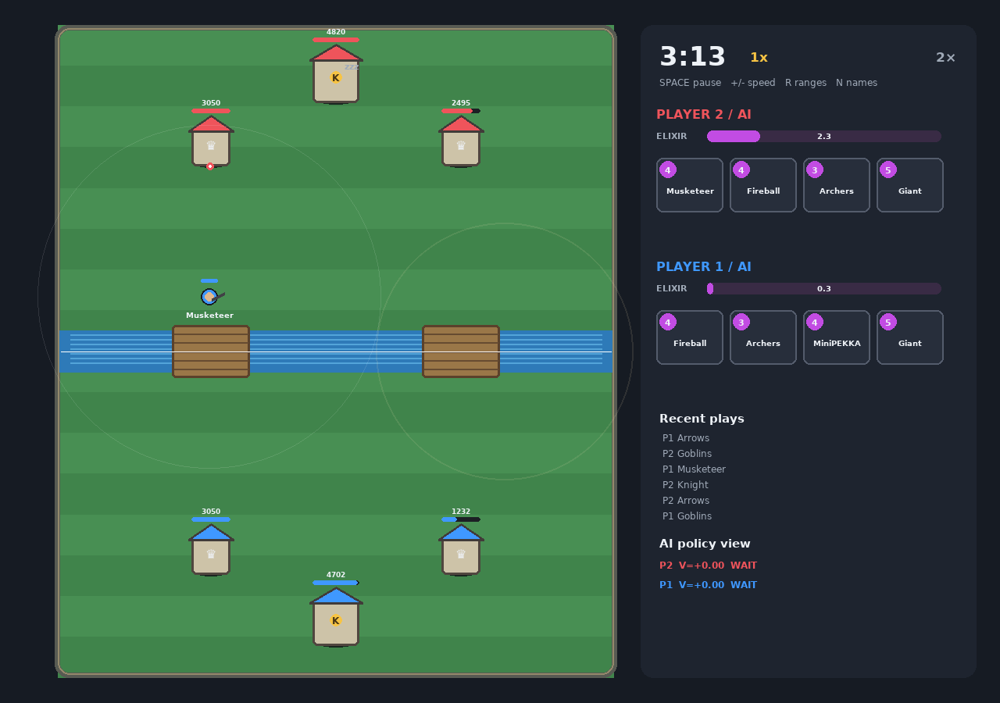
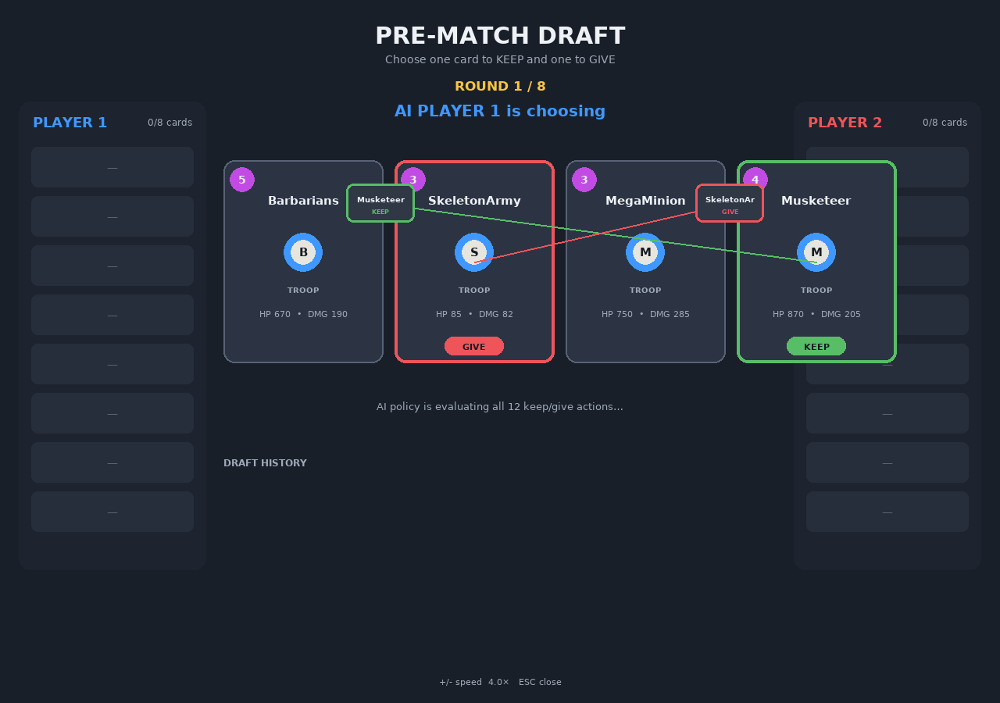
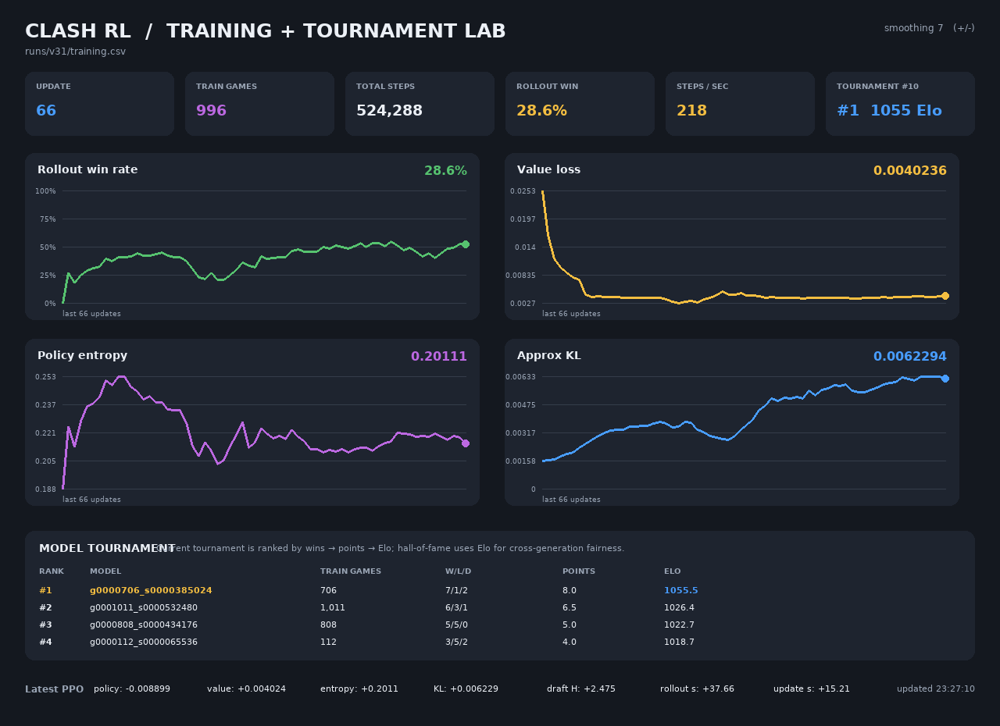

<div align="center">

# ⚔️ ClashRL

### Clash Royale–inspired arena where neural agents draft, battle and evolve

[](https://www.python.org/)
[](https://pytorch.org/)
[](#how-the-agent-learns)
[](#card-roster)

**A clean-room two-player arena simulator for reinforcement-learning experiments.**  
One checkpoint learns both an eight-round adversarial draft and real-time card deployment, then competes against historical versions of itself.

</div>

> [!IMPORTANT]
> ClashRL is an independent research simulator. It is not affiliated with Supercell, does not use the official game engine or client, and does not claim frame-perfect card balance.



## Why this project is fun

This is more than a tiny Gym-style environment. ClashRL includes the complete loop around an agent: simulation, legal-action masking, learned deck construction, PPO self-play, historical opponents, tournament evaluation, visual debugging and human play.

- **44 cards** across troops, buildings and spells
- **Learned keep/give draft** ending in two unique eight-card decks
- **Two-headed actor–critic** with battle and draft policies in one checkpoint
- **PPO self-play** across persistent parallel arenas
- **Snapshot league** supplying diverse historical opponents
- **Hall-of-fame tournaments** between immutable generations with Elo
- **Rich mechanics:** bridges, air, splash, projectiles, shields, charge, spawners, knockback, stun, slow and death effects
- **Visual tools:** animated draft, AI/human battle and a live training dashboard
- **Headless tools:** evaluation, benchmarks, smoke checks and unit tests

## See it in action

| Learned draft | Training lab |
|---|---|
|  |  |

These screenshots are rendered by the project itself. The procedural visuals keep the repository self-contained and focused on simulation rather than borrowed assets.

## How a match works

### 1. Draft eight cards

Each of eight rounds presents four cards to an alternating chooser. The policy selects an **ordered pair**: one card to keep and a different card to give away. The other two leave the pool. After eight rounds, each player has exactly eight unique cards.

There are `4 × 3 = 12` draft actions per offer. The observation encodes the offer, partial decks, chooser, round and card identities. Draft choices receive the final match result, letting the agent learn deck synergy and which awkward counter to hand its opponent.

### 2. Fight in continuous time

Players regenerate elixir, cycle four-card hands and deploy on their own side. Units acquire targets, route toward bridges, cross the river and attack troops, buildings or towers according to targeting rules. Crowns, overtime and hit-point tiebreaks decide the result.

Physics advances at `0.08 s`. Elixir accelerates through 1×, 2× and 3× phases, so late-game behavior differs from the opening.

### 3. Decode the policy action

The battle policy has **49 discrete actions**:

- action `0` waits;
- four hand slots × twelve spatial bins provide `48` deployment choices;
- an action mask removes unaffordable cards and illegal placements before sampling.

The battle observation has **3,207 values** covering towers, elixir, hands, time and fixed-size entity features. The same checkpoint consumes a separate **266-value draft observation**.

## How the agent learns

```text
24 persistent arenas
        │
        ├── current policy vs current / league / hall-of-fame model
        │                    └── learned eight-round draft
        ▼
on-policy rollout (observations, masks, actions, rewards, values)
        │
        ├── GAE advantages + returns
        ▼
PPO epochs over shuffled minibatches
        │
        ├── clipped policy and value objectives
        ├── entropy bonus
        └── gradient clipping
        ▼
new checkpoint ──► snapshot league ──► tournament / Elo
```

| Head | Input | Output | Purpose |
|---|---:|---:|---|
| Battle actor | 3,207 | 49 logits | Wait or card/position deployment |
| Battle critic | 3,207 | 1 value | Expected match return |
| Draft actor | 266 | 12 logits | Ordered KEEP/GIVE pair |
| Draft critic | 266 | 1 value | Current draft position |

The battle backbone is a three-layer MLP with `LayerNorm` and `Tanh`; the draft backbone is a separate two-layer MLP. Orthogonal initialization and small policy-head gains start both policies near-uniform without coupling two different decision spaces.

### League vs tournament

- `league/` is a training population. Historical snapshots are sampled during self-play to reduce strategy collapse and forgetting.
- `tournament/` is evaluation. Immutable contenders play every other active contender with learned draft enabled.
- A tournament ranks **wins → points → Elo**. The persistent hall of fame uses **Elo first**, because lifetime wins favor older checkpoints.
- The hall-of-fame champion may re-enter training as an opponent, linking evaluation back into learning.

In the development run, tournament #10 evaluated six generations over ten games each. Generation `g0000706_s0000385024` finished first with **7 wins, 2 draws, 1 loss and 1055.5 Elo**. Training artifacts are ignored by Git because checkpoints quickly grow to hundreds of megabytes.

## Card roster

Stats are approximate and tuned for learning dynamics, not copied live balance values.

| Archetype | Cards | Mechanics |
|---|---|---|
| Fighters & tanks | Knight, Giant, Mini P.E.K.K.A, Valkyrie, Barbarians, Royal Giant | melee, splash, building focus, ranged tank |
| Ranged support | Archers, Musketeer, Bomber, Spear Goblins, Wizard, Dart Goblin, Bowler | projectiles, air targeting, splash, long range |
| Swarms | Goblins, Skeletons, Guards, Skeleton Army | multi-unit deployment, shields, cycling |
| Air | Minions, Mega Minion, Baby Dragon, Balloon, Bats, Minion Horde, Flying Machine | flight, air/ground targeting, death bomb |
| Charge & pressure | Hog Rider, Prince, Dark Prince, Wall Breakers | building focus, charge, shield, suicide explosion |
| Spawners & status | Witch, Ice Golem, Ice Spirit, Fire Spirit, Electro Wizard, Ice Wizard | spawning, death slow/stun, deploy pulse, on-hit status |
| Buildings | Mortar, Goblin Hut, Cannon, Bomb Tower, Tombstone | lifetime, siege, spawning, death effects |
| Spells | Fireball, Arrows, Zap, Giant Snowball, Rocket | area damage, tower scaling, stun, slow, knockback |

All cards are immutable dataclasses in `clashrl/cards.py`: hit points, damage, speed, range, interval, count, radius, targets and special effects remain visible and easy to rebalance.

## Installation

```bash
git clone https://github.com/Mobzya/clash-rl.git
cd clash-rl
python -m venv .venv
source .venv/bin/activate
python -m pip install --upgrade pip
pip install -e .
./run_verify.sh
```

On Arch/EndeavourOS, if a `pygame-ce` wheel is unavailable:

```bash
sudo pacman -S --needed base-devel pkg-config sdl2 sdl2_ttf sdl2_image sdl2_mixer portmidi
pip install --upgrade pygame-ce
```

## Quick start

```bash
python -m clashrl doctor                 # dependency check
python -m clashrl smoke --steps 800      # short headless simulation
./run_demo.sh                            # AI vs random + draft
./run_play.sh                            # human vs latest checkpoint
./run_training_ui.sh                     # trainer + dashboard
```

No trained weights are committed. Create an untrained checkpoint with `python -m clashrl init`, or put a compatible checkpoint at `runs/v31/latest.pt`.

### Recommended training

```bash
python -m clashrl train \
  --run runs/v31 \
  --updates 100 \
  --rollout-steps 8192 \
  --num-envs 24 \
  --workers 0 \
  --snapshot-every 5 \
  --tournament-every-games 100 \
  --tournament-games-per-pair 2 \
  --tournament-max-models 6
```

`--workers 0` is the safe default because observation IPC can outweigh parallel physics. Benchmark your machine before changing it:

```bash
python -m clashrl benchmark --workers 0 2 4 auto --num-envs 24 --steps 2048
```

Useful commands:

```bash
python -m clashrl watch --a latest --b random --speed 4
python -m clashrl eval --a latest --b random --games 20
python -m clashrl dashboard --run runs/v31
python -m clashrl tournament --run runs/v31 --games-per-pair 2 --max-models 6
python -m clashrl leaderboard --run runs/v31 --current
```

## Controls

| Scene | Controls |
|---|---|
| Human draft | click KEEP, click GIVE, `Enter` confirm, `Backspace` reset |
| Arena | `Space` pause, `+/-` speed, `R` ranges, `N` names, `Esc` exit |
| Human battle | `1`–`4` select card, then click a legal arena position |
| Dashboard | `+/-` smoothing window, `Esc` exit |

## Project map

```text
clashrl/
├── core.py          physics, targeting, projectiles and status effects
├── env.py           observations, rewards, action decoding and masks
├── cards.py         card definitions and deck archetypes
├── draft.py         keep/give state machine
├── model.py         battle + draft actor–critic
├── ppo.py           rollout collection and PPO updates
├── league.py        historical self-play snapshots
├── tournament.py    contenders, round robin and Elo
├── parallel.py      optional shared-memory workers
├── evaluate.py      headless drafted evaluation
├── visualize.py     draft, arena and human-play UI
├── dashboard.py     live training and tournament charts
└── cli.py           command-line interface
```

## Testing

```bash
python -m unittest discover -s tests -v
```

The suite covers combat, towers, bridges, targeting, draft invariants, masks, PPO rollout/update, tournament persistence and every procedural render branch.

## Scope and limitations

ClashRL is intentionally compact. Navigation and collision are approximations; champions, evolutions and many official card-specific exceptions are absent. A policy can become strong **inside this simulator** without transferring to the commercial game. That separation keeps the environment inspectable, fast, offline and safe to modify.

---

<div align="center">
Built as a playground for self-play, emergent deck-building and surprisingly dramatic neural decisions.
</div>
